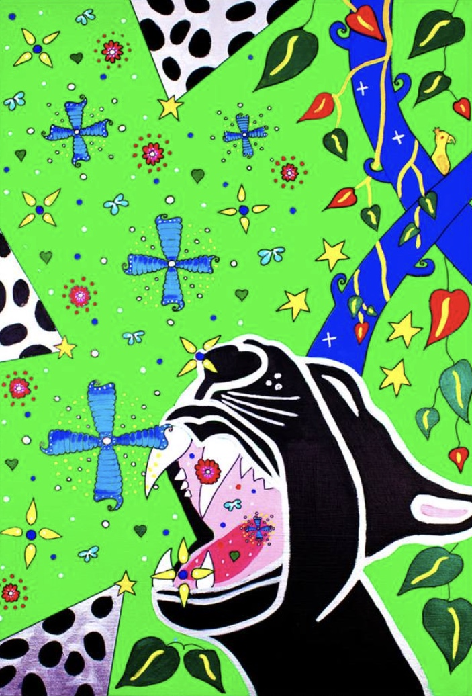

<div align="center">

# 𓂀 Anubis

**Voice-Driven Neurophenomenology for Psychedelic Experience**

*Real-time AI voice interviews that probe the fine structure of subjective psychedelic experience*


[](https://cloud.google.com)
[](LICENSE)

</div>

---

## About

Anubis is a voice-driven neurophenomenology application for conducting granular psychedelic trip report interviews. Using Google's Gemini Live API, it engages users in real-time spoken dialogue to explore and document the micro-dynamics of psychedelic experience with unprecedented detail.

Anubis' voices are based on ancient deities — so it's pretty kitsch right now. Others say they like Anubis' imaginary aspects. The theatrical character voices create a unique interview atmosphere that sits somewhere between the sacred and the absurd.

Anubis covers **vision reports and experience integration**, not crisis intervention. It draws on the kind of granular phenomenological approach championed by practitioners like Marc Aixalà at [ICEERS](https://www.iceers.org/) in the field of integration therapy.

## Features

- 🎙️ **Real-Time Voice Interaction** — Gemini Live API for fluid, natural conversation
- 🔄 **Self-Annealing Directive System** — Learns from errors and refines its approach over time
- 🏗️ **3-Layer Architecture** — Directives / Orchestration / Execution for robust interview management
- 🔒 **Privacy-First Design** — No data persistence by default; local save optional with auth
- 🎭 **Deity-Themed Voices** — Ancient character voices for a theatrical interview experience
- 🔐 **Auth System** — Optional authentication for local conversation recording
- 🔬 **Granular Phenomenology** — Probes the fine structure of subjective psychedelic experience

## Architecture

```
┌─────────────────┐
│   Directives    │  ← Interview strategy & self-annealing rules
├─────────────────┤
│  Orchestration  │  ← Session flow, state management
├─────────────────┤
│   Execution     │  ← Gemini Live API, voice I/O, recording
└─────────────────┘
```

## Screenshots

<p align="center">
  
  
  
</p>
<p align="center">
  
</p>

## Tech Stack

| Layer | Technology |
|-------|-----------|
| Frontend | React + TypeScript, Vite |
| AI | Google Gemini Live API |
| Deployment | Google Cloud |
| Auth | Built-in authentication system |

## Installation

```bash
# Clone the repository
git clone https://github.com/chaosste/Anubis.git
cd Anubis

# Install dependencies
npm install

# Configure your Gemini API key
# (see .env.example or environment configuration)

# Run development server
npm run dev
```

## ⚠️ Important Disclaimer

> **Anubis is NOT a therapist, counsellor, or mental health professional.** It is a research and documentation tool for exploring subjective experience through structured interview techniques.

- This application does **not** provide medical, psychological, or therapeutic advice
- It is **not** a substitute for professional mental health support
- Anubis is designed for **experience reports and integration**, not crisis intervention
- If you are in crisis, please contact your local emergency services or a crisis helpline
- The developers assume no responsibility for how this tool is used
- Use of psychedelic substances may be illegal in your jurisdiction

## Related Projects

> 💡 **Like Anubis?** Check out [MicroPhenom AI](https://github.com/chaosste/MicroPhenom-AI-1) — the vanilla edition for granular reports on wider lived experience. Or try [NeuroPhenom AI](https://github.com/chaosste/NeuroPhenom-AI) — the high-fidelity clinical interface for mapping pre-reflective subjective experience.

---

<div align="center">

**Built by [Steve Beale](https://newpsychonaut.com)**

[newpsychonaut.com](https://newpsychonaut.com)

© 2026 Stephen Beale. MIT License.

</div>
